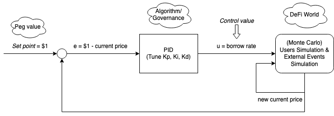

# LFGHO
Hackathon project for LFGHO

# DeFi Monte Carlo Simulation for testing GHO borrow rate effects

Inspired by [Emilio's talk](https://youtu.be/tsg-SnmYuTc?list=PLXzKMXK2aHh7_aNhgt1bA71dcW5Pc13Nw&t=2882) on GHO and Decentralized Stablecoins, this repository tries to show how PIDs and Fuzzy Logic can be used to control the borrow rates of a token to try to keep the value of the token pegged to a pre-defined value.

## Proportional–integral–derivative controller

In the above model, the PID controller sets the borrow rate of GHO based on how far the current value of GHO is from the peg. It simulates DeFi interactions by doing a Monte Carlo simulation of users and random events (like a tweet which causes panic).